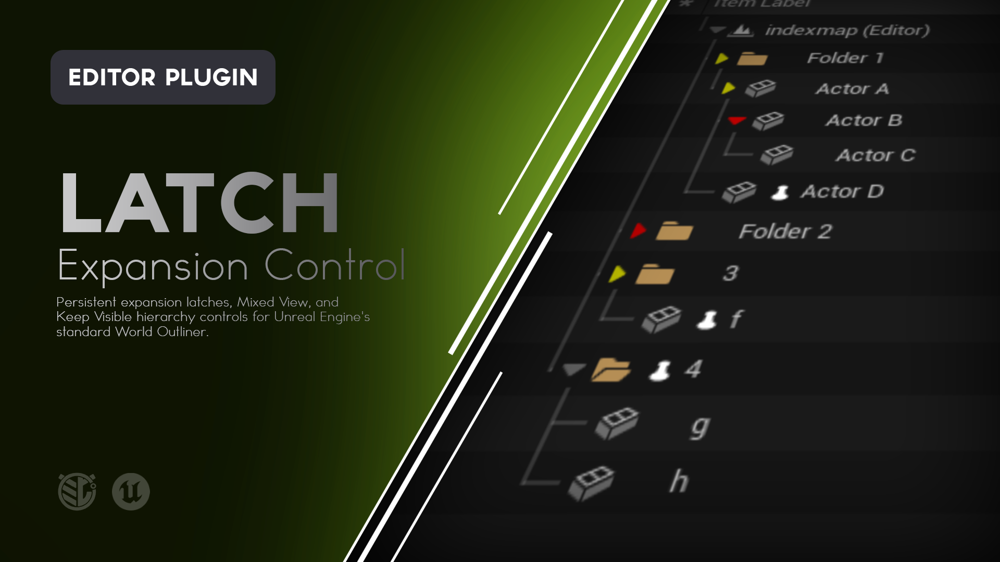
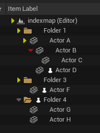
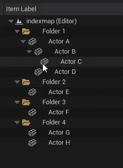
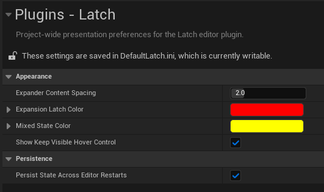

# Latch

**Persistent hierarchy control for Unreal Engine's World Outliner.**

Latch adds expansion latching, selective hierarchy exposure, and Keep Visible pins directly to the standard World Outliner.

Keep important branches open or closed, expose only the descendants you need, and preserve your hierarchy view without changing Actors, folders, attachments, visibility, transforms, ordering, or gameplay state.

  
  
  
  




---

## What is Latch?

Large levels often develop deep Actor and Folder hierarchies.

As those hierarchies grow, the World Outliner can become difficult to keep arranged the way you want. Branches reopen when you did not want them to. Important descendants disappear behind collapsed parents. Selecting something in the viewport can expand more of the hierarchy than you wanted to see.

Latch adds persistent hierarchy controls directly to the World Outliner so you can decide what stays open, what stays closed, and what remains visible through a collapsed branch.

With Latch you can:

- Latch a branch open
- Latch a branch closed
- Keep specific Actors or Folders visible through collapsed ancestors
- Reveal only the minimum hierarchy path required for selected or pinned descendants
- Apply Latch controls across multi-selections
- Use recursive Shift-click while respecting existing latches
- Access Latch controls from both the World Outliner and viewport context menu
- Preserve Latch state across level reloads and editor restarts
- Suspend Latch temporarily without deleting your saved state

Latch is designed to control the **presentation of the World Outliner**, not the scene itself.

---

# Features

### Expansion Latches

Latch any parent row open or closed.

A latched row uses a Red expansion triangle and resists normal expansion changes until it is unlatched.

### Mixed View

When a collapsed branch contains something that still needs to remain visible, Latch can expose only the minimum required hierarchy path.

Mixed ancestors use a Yellow triangle.

### Keep Visible

Pin an Actor or Folder so it remains visible through collapsed ancestors.

Keep Visible follows the item itself when it is renamed, reparented, attached, detached, moved between folders, or moved to the Outliner root.

### Native Outliner Interaction

Latch extends the existing expansion controls rather than replacing the World Outliner with a separate hierarchy view.

### Multi-Selection Support

Use Latch context-menu commands, Alt-click expansion latches, and Keep Visible pins across several selected rows at once.

### Recursive Expansion

Shift-click recursively expands or collapses an unlocked hierarchy while respecting Red latched descendants.

### Viewport Context Menu

Selected Actors can access the same Latch commands from the Level Editor viewport right-click menu.

### Search-Aware Presentation

World Outliner search temporarily takes presentation authority while active. When search clears, Latch restores the previous logical hierarchy state and recalculates Mixed View.

### Persistent Editor State

Expansion Latches, Keep Visible state, and Suspend state can persist across level reloads and separate Unreal Editor sessions without saving or dirtying the level.

### Project Settings

Customize spacing, semantic colors, Keep Visible hover behavior, and persistence from **Project Settings > Plugins > Latch**.

### Editor Only

Latch is an editor utility and adds no runtime system to packaged builds.

---



---

# Using Latch

Latch works directly inside the standard World Outliner.

Its visual language is intentionally small and consistent:

| Visual | Meaning |
| --- | --- |
| **Grey triangle** | Normal Unreal expansion behavior |
| **White triangle on hover** | Native hover feedback for an unlocked row |
| **Red triangle** | This row's own expansion state is latched |
| **Yellow triangle** | Mixed View. The row is logically collapsed while required descendants remain exposed |
| **Grey pin on hover** | Keep Visible is available for this item |
| **White pin** | Keep Visible is enabled for this item |

Red takes precedence over Yellow.

---

## Normal Expansion

A Grey triangle behaves like Unreal normally does.

- Click to expand or collapse the row.
- Shift-click to recursively expand or collapse unlocked descendants.
- Alt-click to latch the row in its current logical state.

---

## Latch Expanded

Expand a parent row, then Alt-click its triangle.

The triangle turns Red and the branch becomes **Latched Expanded**.

While Latched Expanded:

- Normal triangle clicks do not collapse the row.
- Collapse All does not permanently collapse it.
- Recursive Shift-click from an ancestor does not override it.
- Alt-click the Red triangle to unlatch it.

---

## Latch Collapsed

Collapse a parent row, then Alt-click its triangle.

The triangle turns Red and the branch becomes **Latched Collapsed**.

While Latched Collapsed:

- Normal triangle clicks do not expand the row.
- Expand All does not permanently expand it.
- Recursive Shift-click from an ancestor does not override it.
- Alt-click the Red triangle to unlatch it.

---

## Mixed View

Mixed View allows a logically collapsed hierarchy to expose only the descendants that currently need to remain visible.

For example:

```text
Folder
└── Actor A
    └── Actor B
        └── Actor C
```

If `Folder`, `Actor A`, and `Actor B` are collapsed, then `Actor C` is selected from the viewport, Latch can present:

```text
Yellow Folder
└── Yellow Actor A
    └── Yellow Actor B
        └── Actor C
```

Only the minimum required real hierarchy path is exposed.

Unrelated siblings remain hidden until the hierarchy is genuinely expanded.

Clicking a Yellow triangle performs a normal full expansion of that branch and returns it to ordinary Grey expansion behavior.

Mixed View can be caused by:

- selected descendants
- Keep Visible items
- Latched Expanded descendants beneath a logically collapsed ancestor

Mixed View is derived presentation state. It is not saved as its own latch mode.

---

## Keep Visible

Every eligible Actor and Folder row has a small reserved pin slot between its normal icon and item label.

When Keep Visible is off:

- the slot is visually empty
- hovering the slot reveals a subdued Grey pin

When Keep Visible is on:

- the pin remains visible in White
- collapsed ancestors can enter Yellow Mixed View to keep that item exposed

Click the pin again to disable Keep Visible.

You can also use:

**Right Click > Latch > Keep Visible**

Keep Visible belongs to the item itself rather than its current position in the hierarchy.

This means the White pin follows an Actor or Folder when it is:

- renamed
- reparented
- attached or detached
- moved between folders
- moved to the Outliner root

Duplicated or newly created items start unpinned.

Temporary exposure caused only by selection does not display a White pin.



---

# Working with Multiple Items

Latch supports multi-selection directly in the World Outliner.

If several rows are selected, interacting with one of those selected rows can apply the same action across the eligible selection.

### Expansion Latches

Alt-clicking the triangle on a selected parent row applies the clicked row's intended latch action to every eligible selected parent.

Childless rows are ignored because they have no expansion state to latch.

### Keep Visible

Clicking the pin on a selected row uses a batch toggle:

- If the selected set is mixed or unpinned, Keep Visible is enabled for all eligible selected items.
- If every eligible selected item is already pinned, Keep Visible is disabled for all of them.

### Unselected Rows

If you interact with a row that is not part of the current selection, only that clicked row is changed.

This prevents an unrelated existing multi-selection from receiving an unexpected Latch action.

---

# Recursive Expand and Collapse

Shift-click an unlocked hierarchy triangle to recursively expand or collapse that branch.

Latch preserves any Red descendants while applying the recursive operation to unlocked items.

For example, if a child is Latched Expanded and you recursively collapse its ancestor, the Red child remains expanded.

If a branch is in Yellow Mixed View, Shift-click operates on its logical hierarchy state rather than the temporary presentation used to expose required descendants.

After a recursive collapse, a selected or Keep Visible descendant may immediately recreate the minimum Yellow Mixed path needed to remain visible. This is expected.

---

# Context Menu

Right-click an Actor or Folder in the World Outliner and open the **Latch** submenu.

Available commands include:

- **Latch Current Expansion**
- **Latch Expanded**
- **Latch Collapsed**
- **Unlatch Expansion**
- **Keep Visible** / **Stop Keeping Visible**
- **Clear Latch State in Branch**
- **Clear Latch State in Selected Branches**
- **Suspend Latch** / **Resume Latch**
- **Clear All Expansion Latches**
- **Clear All Keep Visible States**
- **Clear All Latch State**

When several eligible rows are selected, the relevant commands operate on the selected set.

Expansion commands are unavailable for items with no real children.

---

# Viewport Context Menu

Selected Actors can also access Latch through the Level Editor viewport right-click menu.

This provides the same Actor-oriented Latch commands without requiring you to move back to the World Outliner first.

Folders remain Outliner-only because they do not have a viewport representation.

---

# Search Behavior

Latch yields temporary presentation control to Unreal while World Outliner search is active.

When search begins:

1. Latch preserves the current logical hierarchy state.
2. Unreal is free to expose and navigate search results normally.
3. Red Expansion Latches and White Keep Visible state remain unchanged.

When search clears:

1. Latch restores the pre-search logical expansion state.
2. Persistent Red and White state is reapplied.
3. Yellow Mixed View is recalculated from the current selection and Keep Visible requirements.

Searching therefore does not silently become a permanent hierarchy expansion decision.

---

# Suspend Latch

Use **Suspend Latch** when you temporarily want normal Unreal hierarchy behavior without deleting your saved Latch state.

While suspended:

- Red and Yellow semantic presentation is removed.
- Normal Unreal expansion behavior returns.
- Existing Expansion Latches and Keep Visible state are retained internally.

Use **Resume Latch** to reapply the saved state and recalculate Mixed View.

---

# Parent Lifecycle

Expansion Latches only exist while an item is actually a parent.

If an Actor or Folder loses its final real child, its Expansion Latch is automatically cleared.

If children are added again later, the item starts with normal Grey expansion behavior.

Keep Visible is independent of this rule and can remain enabled on leaf items.

---

# Persistence

Latch state is editor workspace state rather than level content.

By default, the following survive level reloads and separate Unreal Editor sessions:

- Expansion Latches
- Keep Visible state
- Suspend state

Latch stores this information in Unreal's per-project editor configuration.

It does **not** serialize Latch state into Actors or level packages, and changing Latch state does not dirty the map.

This means you do not need to save the level simply to preserve your Outliner arrangement.

### Identity and Hierarchy Changes

Latch follows stable Actor and Folder identity where available.

As a result:

- renaming preserves Latch state
- reparenting preserves Keep Visible and valid parent latches
- moving items between folders preserves their state
- moving an item to the root does not clear Keep Visible
- duplicated items begin without copied Latch state
- deleted Actors have their Latch state removed

Undoing a deleted Actor does not intentionally resurrect its previous Latch state.

---

# Project Settings

Open:

**Edit > Project Settings > Plugins > Latch**

## Appearance

| Setting | Default | Purpose |
| --- | --- | --- |
| **Expander Content Spacing** | 2 | Adds horizontal spacing between the hierarchy triangle and Actor or Folder content. Range: 0 to 10 Slate units |
| **Expansion Latch Color** | Red | Controls the semantic color used for Expansion Latches |
| **Mixed State Color** | Yellow | Controls the semantic color used for Mixed View |
| **Show Keep Visible Hover Control** | On | Shows the inactive Grey pin when hovering its reserved slot. Active White pins remain visible regardless |

A spacing value of `0` matches Unreal's normal expander-to-content spacing.

## Persistence

### Persist State Across Editor Restarts

Enabled by default.

When disabled:

- Latch state remains available during the current editor session
- saved Latch persistence is cleared
- the next editor session starts without persistent Red or White state

This setting does not change level data.

## Utilities

### Clear Saved Latch State

Clears saved Expansion Latches and Keep Visible state for the project after confirmation.

This does not modify levels or Actors.



---

# Example Workflow

Imagine a large environment with several deeply nested folders and attached Actor hierarchies.

You want one finished section to stay collapsed, one active work area to stay open, and two important gameplay Actors to remain visible no matter how their surrounding folders are arranged.

You could:

1. Collapse the finished section and Alt-click its triangle to make it **Latched Collapsed**.
2. Expand the active work area and Alt-click its triangle to make it **Latched Expanded**.
3. Enable **Keep Visible** on the two gameplay Actors.
4. Continue collapsing other branches normally.
5. Let Latch create Yellow Mixed paths only where those pinned Actors need exposure.
6. Use Suspend Latch temporarily if you need to inspect the hierarchy using completely native Unreal expansion behavior.

The scene hierarchy itself remains unchanged throughout the workflow.

---

# Installation

Latch can be installed through **Fab**, from a **precompiled GitHub Release**, or directly from the **GitHub source**.

For most users, the Fab or GitHub Release installation is recommended.

---

## Fab / Epic Games Launcher

> **Availability:** Use this installation method once Latch is available through Fab.

1. Add **Latch** to your library on Fab.
2. Open the **Epic Games Launcher**.
3. Navigate to your Unreal Engine Library.
4. Locate Latch in your Fab / Vault library.
5. Install Latch to the supported Unreal Engine version.
6. Launch your Unreal Engine project.
7. Open **Edit > Plugins**.
8. Search for **Latch**.
9. Enable the plugin if it is not already enabled.
10. Restart Unreal Editor if prompted.

Once enabled, Latch controls are available directly in the World Outliner.

---

## GitHub Release

This is the easiest GitHub installation method because the release package is already prepared for the supported Unreal Engine version.

### 1. Download Latch

Open the repository's **Releases** page:

https://github.com/mippi-the-dork/Latch/releases

Download the latest package matching your Unreal Engine version and platform.

For example:

```text
Latch-v1.0.0-UE5.8.2-Win64.zip
```

### 2. Close Unreal Editor

Close the project before installing the plugin.

### 3. Locate Your Project Plugins Folder

Your project should contain a `Plugins` directory beside the `.uproject` file:

```text
YourProject/
├── Config/
├── Content/
├── Plugins/
└── YourProject.uproject
```

If the `Plugins` directory does not exist, create it.

### 4. Extract Latch

Extract the `Latch` folder into:

```text
YourProject/Plugins/
```

The final structure should look similar to:

```text
YourProject/
├── Plugins/
│   └── Latch/
│       ├── Config/
│       ├── Doc/
│       ├── Resources/
│       ├── Source/
│       └── Latch.uplugin
└── YourProject.uproject
```

### 5. Launch the Project

Open your Unreal Engine project.

If necessary, navigate to:

**Edit > Plugins**

Search for:

```text
Latch
```

Enable the plugin and restart Unreal Editor if prompted.

---

## GitHub Source

Developers who want the latest source or want to modify Latch can clone the repository directly.

### Requirements

Building Latch from source requires a working Unreal Engine C++ development environment.

For Windows this generally means:

- Unreal Engine 5.8.x
- Visual Studio with the appropriate C++ workloads
- A project capable of compiling C++ plugins

### Clone the Repository

Close Unreal Editor and navigate to your project's `Plugins` directory.

```bash
cd YourProject/Plugins
git clone https://github.com/mippi-the-dork/Latch.git
```

Your project should now contain:

```text
YourProject/Plugins/Latch/
```

### Generate Project Files

If necessary:

1. Right-click your `.uproject`.
2. Select **Generate Visual Studio project files**.

Then open the generated solution and build your project's Editor target.

For example:

```text
YourProjectEditor
Win64
Development Editor
```

Launch the project after compilation completes.

---

# Updating Latch

## GitHub Release Installation

When updating a manually installed release:

1. Close Unreal Editor.
2. Remove the existing `Plugins/Latch` folder.
3. Extract the new Latch release into the `Plugins` directory.
4. Reopen the project.

Replacing the complete plugin folder is recommended rather than copying individual files over an older version.

## Git Source Installation

If you cloned the repository using Git:

```bash
cd YourProject/Plugins/Latch
git pull
```

Rebuild the project if the source has changed.

---

# Compatibility

The current Latch release targets:

| | |
| --- | --- |
| **Latch Version** | 1.0.0 |
| **Unreal Engine** | 5.8.0 - 5.8.3 |
| **Platform** | Windows 64-bit |
| **Plugin Type** | Editor |
| **Runtime Dependency** | None |
| **Packaged Game Impact** | None |

Latch is currently configured as a **Win64 editor plugin**.

Compatibility with additional Unreal Engine versions or platforms should not be assumed unless explicitly listed in a release.

---

# How Latch Works

Latch extends the World Outliner while keeping Unreal's real hierarchy authoritative.

At a high level:

1. Latch observes the existing Outliner hierarchy and expansion controls.
2. Persistent Expansion Latches record whether an eligible row should remain expanded or collapsed.
3. Keep Visible records which Actors or Folders should remain exposed through collapsed ancestors.
4. Mixed View temporarily opens only the hierarchy paths required for selected, pinned, or Latched Expanded descendants.
5. Unrelated sibling rows remain suppressed while traversing a logically collapsed Mixed path.
6. When the exposure requirement disappears, Latch restores the underlying logical expansion state.

Latch does not manufacture an alternate Actor hierarchy.

The actual Scene Outliner hierarchy remains the source of truth.

---

# What Latch Does Not Do

Latch is an **editor hierarchy presentation utility**.

It does not:

- reparent Actors
- change Folder membership
- change scene visibility
- change Hidden in Game
- move, rotate, or scale Actors
- change Actor ordering
- add gameplay components
- modify packaged game behavior
- serialize Latch state into level or Actor data
- replace Unreal's World Outliner with a separate hierarchy system

Latch controls how the hierarchy is presented while you work.

---

# Limitations

### Editor Only

Latch is designed for Editor worlds.

PIE and runtime-spawned Actors do not receive persistent Latch state.

### World Outliner Scope

Latch controls hierarchy presentation in the World Outliner. It does not change how Actors are organized in the actual level.

### Keep Visible Requires an Ancestor

A root-level item can remain marked Keep Visible, but there is no ancestor for Latch to expose through until the item is moved beneath another Actor or Folder.

### Expansion Latches Require Children

An item with no real children cannot maintain an Expansion Latch.

If a latched parent loses its final child, the Expansion Latch is automatically cleared.

### Search Temporarily Takes Presentation Authority

While World Outliner search is active, Unreal controls the temporary search presentation. Latch restores its logical state after search clears.

### Per-Project Editor State

Persistent Latch state is stored as per-project editor configuration rather than level data. It should be treated as editor workspace state rather than shared scene content.

---

# Troubleshooting

## Latch Does Not Appear in the World Outliner

Check:

**Edit > Plugins**

Search for:

```text
Latch
```

Confirm that the plugin is enabled.

Restart Unreal Editor if the plugin was just enabled.

---

## Alt-Click Does Not Latch an Item

Confirm that the item has at least one real child.

Expansion Latches are only meaningful for parent rows.

---

## A Selected Descendant Shows Yellow Ancestors

This is Mixed View and is expected.

The ancestor remains logically collapsed while Latch exposes the minimum path required to show the selected descendant.

Click the Yellow triangle if you want to fully expand the branch normally.

---

## A White Pin Does Not Change Scene Visibility

Keep Visible affects **World Outliner presentation only**.

It does not show or hide the Actor in the viewport or during gameplay.

---

## A Latch State Did Not Persist After Restart

Open:

**Project Settings > Plugins > Latch**

Confirm that **Persist State Across Editor Restarts** is enabled.

If it is disabled, Latch state is intentionally session-only.

---

## A Latched Parent Became Unlatched

Check whether the item lost its final real child.

Latch automatically clears Expansion Latches when an item stops being a parent.

---

## Search Changed the Visible Hierarchy

Search temporarily uses Unreal's native presentation behavior.

Clear the search field. Latch should restore the previous logical hierarchy state, then recalculate any required Mixed paths.

---

# Reporting Bugs

If you encounter a problem, please open an issue:

https://github.com/mippi-the-dork/Latch/issues

When reporting a bug, include:

- Latch version
- Unreal Engine version
- Windows version
- Whether Latch was installed from Fab, a GitHub Release, or source
- Whether the target was an Actor, Folder, or multi-selection
- Whether the issue involved a Red latch, Yellow Mixed View, or White Keep Visible pin
- Whether World Outliner search was active
- Steps to reproduce the problem
- Screenshots or video when relevant
- Any relevant Unreal Editor log output

Clear reproduction steps make issues much easier to diagnose.

---

# Feature Requests

Suggestions and feature requests are welcome through GitHub Issues.

When proposing a feature, describe the hierarchy workflow problem you're trying to solve rather than only the implementation you would like to see.

That makes it easier to determine whether the feature belongs in Latch and whether there may be a simpler solution.

---

# Contributions

Pull requests are welcome.

If you're considering a significant change, opening an Issue first is recommended so the direction can be discussed before substantial work is done.

Latch is intended to remain a focused World Outliner hierarchy utility, so additions should support its core purpose without turning it into a general-purpose scene-management suite.

---

# License

Latch is distributed under the **MIT License**.

See [`LICENSE`](LICENSE) for details.

---

# About

Latch is an Unreal Engine editor utility created by **Mippi the Dork**.

The plugin was built around a simple workflow problem:

> A collapsed hierarchy should not have to become an expanded mess just because one important thing inside it still needs to remain visible.

Latch keeps hierarchy state deliberate, readable, and under your control.
